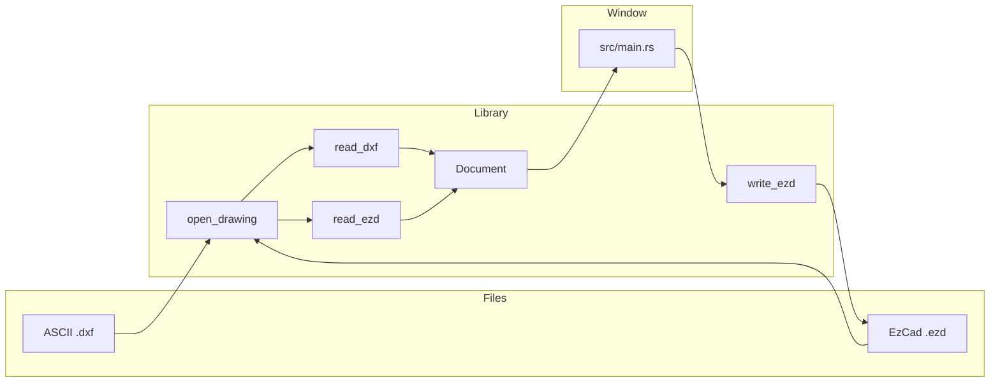
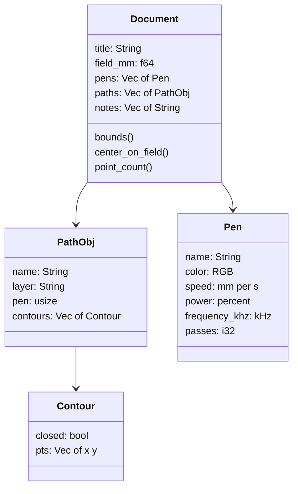
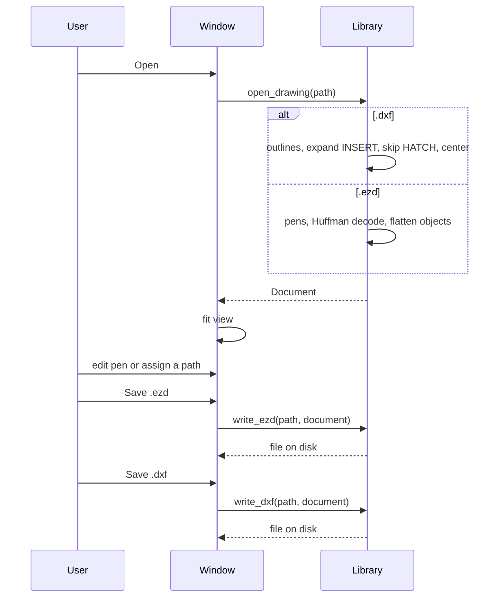

# Architecture

EZD Studio is one Rust crate. The library reads a drawing into a `Document`. The window edits that document. The writer turns it back into an EzCad Unicode `.ezd`.

## Modules

| Module | Role |
| --- | --- |
| `geom` | The only drawing model. Coordinates are millimeters, Y up. |
| `dxf` | ASCII DXF import and export. Import centers the result on the origin. |
| `ezd` | `.ezd` reader, writer, Huffman coder, pen template. |
| `lib` | `Error`, `open_drawing`, and the public re-exports. |
| `main` | eframe 0.31 window. Depends on the library. The library does not depend on the window. |

`open_drawing` looks at the file extension. `.ezd` goes to `read_ezd`. `.dxf` goes to `read_dxf`. Anything else is `Error::Format`.

Errors are `Error::Io` (path plus the OS error) or `Error::Format` (a sentence the status bar can show). Library code returns `Result`. It does not panic on a bad file.

## Document

`Document::new` builds 256 pens. The first eight colors repeat: black, blue, red, green, magenta, yellow, cyan, gray. Defaults are 500 mm/s, 50 percent power, 20 kHz, one pass. Those match the pen-0 values in the sample EzCad job that produced `pen_template.bin`.

A path is one named object on one pen. `layer` is the DXF camada. It is empty for a path read from `.ezd`. A contour is one polyline. Closed contours are flagged. The `.ezd` writer repeats the first point at the end when the gap is larger than `1e-8`.

`notes` holds text strings found inside an opened `.ezd`. The letter outlines, when the file contains them, are ordinary paths. Saving does not write `notes` back as text objects. See [Continuing the work](continuing.md).

`field_mm` defaults to 110, the usual EzCad lens. The window draws that square and a 10 mm grid. `write_ezd` does not store `field_mm`. Changing the field control changes the guide on screen.

`center_on_field` subtracts the bounding-box center from every point. DXF import calls it once. The **Center on field** button calls it again.

## Open and save

The window keeps one `Document`, the last path, the selected path index, and the pan and zoom. Drag pans. Scroll zooms around the pointer, clamped from 0.2 to 80 pixels per millimeter. A click selects the nearest segment within 1.5 mm. Fit runs after open and after center.

The right panel edits the pen of the selected path. Pens 0 through 7 can be assigned from the combo box or the palette. Every path that shares a pen index shares that pen's speed, power, frequency, passes, color, and name. **Fill inside** (⌘F) paints the inside of the selected closed path with that pen color. Press it again to clear the fill. The fill is only on screen. Save still writes the outline.

The font loader reads `/System/Library/Fonts/Supplemental/Arial Unicode.ttf` when it is present, so notes that contain CJK text can draw. If the file is missing, egui keeps its default font and the window still opens.

## What a save keeps

**Save .ezd** builds a new EzCad file:

1. A 344-byte `EZCADUNI` header, version word 2001.
2. A 200 by 200 preview drawn from the current paths.
3. An empty font list.
4. 256 pen records, patched from `pen_template.bin`.
5. One curve object per contour that has at least two points.
6. A type-0 terminator.

Groups, hatches, text objects, and images from an opened `.ezd` are not written back as those types. Their visible strokes survive only when the reader already turned them into `PathObj` contours. Quadratic and cubic curve segments are sampled to polylines on read (eight steps per span), so a later save stores the samples. DXF splines, arcs, circles, ellipses, and bulges are flattened to a 0.001 mm chord on import, and that polyline is what a later save stores.

**Save .dxf** writes an ASCII AutoCAD Release 12 file (`AC1009`) in millimeters. HEADER, TABLES, an empty BLOCKS section, and ENTITIES are all present. Each contour is a `POLYLINE` with `VERTEX` records and a `SEQEND`. A camada used by one pen stays one layer. A camada used by several pens is split, one layer per pen, because EzCad assigns one color to a layer. Every polyline carries ACI group 62. Group 420 is not written. A path with an empty layer uses the pen name as the layer. Hatches are not written. Splines and arcs are already polylines.

Byte layout, object types, and the Huffman table are in [EZD format](ezd-format.md). Import and export rules are in [DXF import](dxf-import.md).
