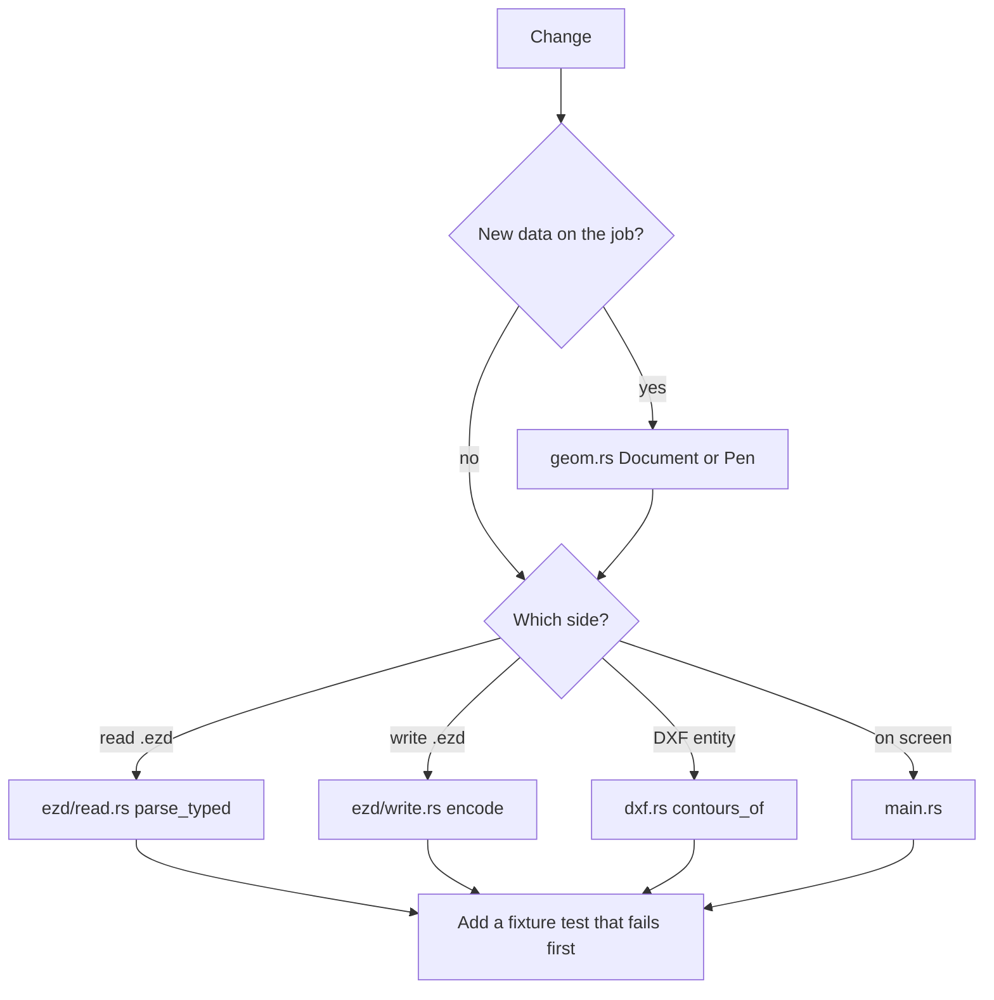

# Continuing the work

Read [Architecture](architecture.md) first, then the format or import page for the area you are changing. Keep new geometry in `Document`. The window should stay a view of that model.

## Build and test

```shell
cd ezd-studio
cargo test
cargo run --release
```

Three tests exist:

| Test | Where | What it checks |
| --- | --- | --- |
| `round_trip_square_keeps_the_corners` | `src/ezd/write.rs` | A 20 by 10 mm box on pen 2 (800 mm/s, 33 percent, 40 kHz) survives `write_ezd` then `read_ezd` |
| `reads_the_sample_ezd_nameplate` | `src/lib.rs` | `../AUTOSAVE.EZD` has more than 10,000 points, a note equal to `Model`, and bounds in a wide range |
| `imports_the_bonequinha_dxf_as_a_markable_outline` | `src/lib.rs` | The absolute Bonequinha DXF path imports, centers, and round-trips within 0.05 mm |

The square test uses only the temp directory. The other two read files that are not in git. `AUTOSAVE.EZD` is the EzCad install's autosave, one directory above this crate. The DXF path is hard-coded under the user's Downloads folder. On another machine those two tests fail before they test the parser.

A good next change is to copy a small `.ezd` and a small ASCII DXF into `ezd-studio/tests/fixtures/` and point the tests at `CARGO_MANIFEST_DIR`. Keep the fixtures small. The full autosave is about 1.5 MB and the full DXF is about 1.3 MB. A fixture only needs one curve, one hatch with a cached group, one text note, and a few DXF entities (a closed spline, a bulge polyline, an INSERT, and a hatch that must be absent from the path list).

`cargo test` from the EzCad install directory does nothing useful. That directory has no `Cargo.toml`. Always pass `--manifest-path ezd-studio/Cargo.toml` or `cd` into `ezd-studio`.

## Checked, and not checked

Checked on this Mac:

- `cargo test` passes when `../AUTOSAVE.EZD` and the Bonequinha DXF are present.
- The reader consumes the whole sample vector stream, including the hatch cached group.
- A written square, and the imported Bonequinha drawing, read back with the same bounds and the edited pen numbers.
- The window starts, opens drawings, and saves `.ezd`. Save .dxf is covered by the library tests. The button itself was not clicked in a live window.

Not checked:

- EzCad 2 on Windows has not reopened a file written after the Huffman padding fix. The dialog "File's format is error,maybe damaged!" is OpenEzdFile return code 5. The identity stream was one byte short of what EzCad's decoder needs, so the decompressed length did not match. The writer now appends that byte. Open a newly saved `.ezd` in EzCad before treating it as production.
- eDrawings rejected the old `.dxf` because it claimed `$ACADVER` AC1021 and then omitted every Release 2007 record (handles, subclass markers, CLASSES, BLOCKS, OBJECTS) and set `$DWGCODEPAGE` to `UTF-8`. The writer now emits Release 12 (`AC1009`, code page `ANSI_1252`): HEADER, TABLES, an empty BLOCKS section, and `POLYLINE` / `VERTEX` / `SEQEND` with ACI group 62. No group 420. A camada with several pens is still split. ezdxf 1.4.4 reads that file with zero audit errors. This Mac cannot run eDrawings or EzCad. Open a newly saved `.dxf` in both before treating it as accepted. In EzCad, Ungroup the VectorFile (Ctrl+U); the blue row is the container. The old `cores.salvas.dxf` on disk is the rejected file.
- Re-saving is not byte-identical. Bezier contours become polylines. Text, hatch, group, and image objects are not rewritten as those types.
- `field_mm` is display-only.

When you report a result, say which of those checks you actually ran.

## Limits to keep in mind

- No EZText writer and no font shaping. Notes are read-only labels. Editing a note does not move glyph outlines.
- Quadratic and cubic EZD curves are flattened with 8 steps. DXF splines, arcs, circles, ellipses, and bulges are flattened until the chord sits within 0.001 mm of the curve. Both lose the original controls.
- DXF hatches are skipped on purpose.
- Old-style POLYLINE plus VERTEX is not imported. `is_geometry` names `POLYLINE`, and `contours_of` returns nothing for it.
- Nested INSERT is dropped.
- DXF units are assumed to be millimeters.
- INSERT ignores a non-zero block base point.
- The pen template freezes every pen field except color, name, passes, speed, power, and frequency.
- The GUI font path is macOS-specific. eframe itself can build on other desktops. The file dialogs use `rfd`.
- There is no CI workflow.

## Where to change things



### A new EZD object type

1. Add the constant next to the others in `read.rs`.
2. In `parse_typed`, consume the body you measured on a real file. Containers already read their child count before the `match`. Hatch still needs `parse_hatch_tail` after its children.
3. Turn markable geometry into a `PathObj`. Skip I/O objects with a sized read, the way timer and image already work.
4. If the writer should emit the type, add it in `encode_vectors`. Until then, a save flattens whatever the reader stored as contours.
5. Unknown type numbers must stay hard errors. A skip of an unknown body will desynchronize every object after it.

### A new DXF entity

1. Add the name to `is_geometry` only when `contours_of` can build polylines from it.
2. Keep HATCH out unless you add a switch and a test that the Bonequinha path count does not jump by the hatch boundaries.
3. For POLYLINE, walk VERTEX records until SEQEND. Those vertices are separate entities in the file, which the current pair walker does not group.
4. Honor `$INSUNITS` before centering if you accept inch drawings. Convert to millimeters in one place, in `read_dxf`, after the paths exist and before `center_on_field`.

### Pen fields beyond the six

Dump one pen from a real file with the struct-list rules in [EZD format](ezd-format.md). Patch that index in both `pen_from_fields` and `pen_record`. Add the value to `Pen` and to the right-hand panel. Extend `round_trip_square_keeps_the_corners` so the new field survives a write and a read.

### Making a written file match EzCad

If Windows EzCad rejects a file that our reader accepts, compare it with a small file EzCad itself saved:

1. Header magic and the 2001 version word.
2. Seek offsets against the real section starts. The file should be packed.
3. Pen 0 still parses as 61 fields, and field 6 is a percent `f64`, not a scaled integer.
4. Vector words 2 and 5. Word 2 is CRC-16/X-25 of the uncompressed object bytes. Word 5 is the same CRC of the first 16 header bytes. A zero in either word is the data-verification dialog.
5. The Huffman table. EzCad checks the checksums before it builds the tree. If those words are right and EzCad still rejects the file, try a real prefix code that our decoder can round-trip. Do not copy the sample's compressed payload. It belongs to that drawing.

Preview pixels are a convenience thumbnail. A wrong preview is unlikely to be why a job fails to mark, but a wrong vector section will.

## Project boundary

This repository is the file tool: open DXF, open `.ezd`, edit pens, save `.ezd` or `.dxf`.

It does not emulate a printer, a USB control card, or a license check. EzCad talks to its marker through its own library, not through the Windows print spooler. Work that continues here stays on the document model, the two file formats, the window, and tests.

The parent directory of this crate is an EzCad 2.14.11 install. It is not part of this git repository. Do not commit `EzCad2.exe`, `Lmc1.dll`, language packs, `AUTOSAVE.EZD`, or `target/`.

## Git

The git root is `ezd-studio/`. `Cargo.lock` is committed because this is an application. `src/ezd/pen_template.bin` is committed because the writer includes it with `include_bytes!`.

The first commit, `initial commit`, also stored `target/`. A later commit removes it from the tree. The files stay on disk, and `.gitignore` keeps them out of new commits. That first commit is still in history, so a clone of the full history is large until the history is rebuilt. The working tree after that later commit is the sources, the lockfile, the pen template, and these docs.

```shell
cd ezd-studio
git status
cargo test
```
