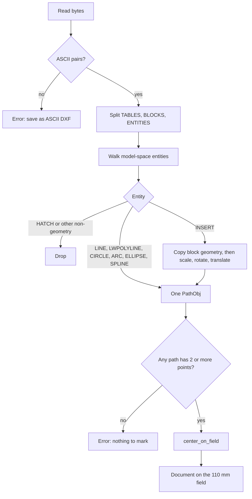

# DXF import

`read_dxf` turns an ASCII DXF into mark paths. Units are taken as millimeters. The reader does not look at `$INSUNITS`. The Bonequinha drawing that this importer was checked against is AutoCAD AC1021, `$INSUNITS` 4, which is millimeters. A file saved in inches will be treated as millimeters and will look about 25 times too small.

Binary DXF is rejected. The message asks for an ASCII save from the CAD program. Group codes and values are trimmed, so both LF and CRLF files parse.

## Pipeline

Only the ENTITIES section becomes model space. A block is stored and drawn when an INSERT names it. Paper-space blocks sit in the block table and stay unused unless something inserts them. Group 67 (paper space) is not filtered, so a paper-space entity that was written into ENTITIES would be imported.

## What is imported

| Entity | Result |
| --- | --- |
| LINE | one open contour, groups 10/20 and 11/21 |
| LWPOLYLINE | one contour. Flag 70 bit 0 closes it. Group 42 bulge becomes arc samples |
| CIRCLE | closed loop, group 40 radius, about one sample every 22.5 degrees |
| ARC | open sweep from group 50 to 51, degrees, counterclockwise |
| ELLIPSE | major axis 11/21, ratio 40, parameters 41 and 42, 72 steps, then rotated |
| SPLINE | degree-3 de Boor, 4 samples on each non-empty knot span. Weights from group 41 when present |
| INSERT | each supported child, transformed. Nested INSERT inside a block is dropped |
| POINT | recognized and then discarded. A point is not a mark path |
| POLYLINE / VERTEX | listed as geometry, but `contours_of` has no VERTEX walk, so the entity produces nothing |
| HATCH | never stored. Solid hatches in these drawings repeat the spline boundaries |

SPLINE flags: bit 0 (closed) marks the contour closed. A contour is also closed when the first and last samples are under 0.05 mm apart. If the knot vector is too short, or the degree is 1, the control points are used as a polyline. If there are no control points, fit points (groups 11 and 21) are the polyline. Samples closer than 0.002 mm are removed.

LWPOLYLINE bulge uses the usual arc: included angle is `4 * atan(bulge)`, and the step count follows the sweep between 4 and 64.

INSERT reads the block name (group 2), insert point (10/20), scales (41 and 42, default 1), and rotation (50, degrees). Each child point is scaled, then rotated, then translated. There is no block base-point correction beyond that. The Bonequinha `Block_0` base is the origin, so this matches that file. A block whose base is not the origin will land in the wrong place until group 10/20 of the BLOCK record is applied.

## Hatches

The Bonequinha file has one model-space HATCH whose boundary count (group 91) is 60, matching the 60 model-space splines, plus many solid hatches inside `Block_0`. Importing both the splines and the hatch boundaries would mark each edge twice. `is_geometry` does not include `HATCH`, so those entities never become paths.

If a future drawing has a hatch and no underlying spline, this rule hides the only markable shape. That case needs an explicit option. The default stays "skip hatch" so the files this project was built for stay single-stroke.

## Color to pen

Group 62 is the ACI color. 256 means ByLayer, and the layer's color from the LAYER table is used. A missing layer color becomes 7.

| ACI | Pen |
| --- | --- |
| 1 red | 2 |
| 2 yellow | 5 |
| 3 green | 3 |
| 4 cyan | 6 |
| 5 blue | 1 |
| 6 magenta | 4 |
| 7 and anything else | 0 |

Pens 1 through 6 in a new document use the matching palette colors from `Document::new`. Pen 0 is black.

The importer stores the camada on `PathObj::layer`. An entity with no group 8 is layer `0`. Geometry inside a block that sits on layer `0` takes the INSERT's layer. Group 420, when present, is a 24-bit RGB color and wins over the ACI pen table, so a file this program saved reopens with the same pen colors.

## DXF export

`write_dxf` writes ASCII DXF, `$ACADVER` AC1021, `$INSUNITS` 4. Each contour with at least two points becomes one `LWPOLYLINE`. Coordinates are the current millimeters, including the centering import already applied.

The layer is the stored camada. When `layer` is empty, which is every path read from `.ezd`, the layer name is the pen name. The LAYER table color is the pen used by the most contours on that layer. A tie uses the lower pen index. That color is written as the nearest ACI (group 62) and as the exact RGB (group 420). An entity whose pen color is different also carries 62 and 420. Entities that match the layer omit those groups and stay ByLayer.

A closed contour does not repeat its first point in the file. Group 70 bit 0 marks it closed. Characters a DXF layer name cannot contain (`<>/\:;?*|,=`) become underscores.

## Placement

After every entity is converted, `center_on_field` shifts the bounding box onto the origin. EzCad's usual workspace is a 110 mm square with the origin in the middle. The field control in the window does not change this shift. A drawing larger than the field still imports. It is centered, and it may hang past the square. The status bar shows the real width and height.

Path names are `Line N`, `Polyline N`, `Spline N`, `Circle N`, `Arc N`, `Ellipse N`, or, for an insert, the block name plus the same counter. The camada is stored separately on `layer` and is not part of that name.

## Bonequinha check

The file used while building this importer lives outside the repo:

`/Users/byellokore/Downloads/DXFFFFBONEQUINHA ( Cliente Rafa Dutra.dxf`

The name has no closing parenthesis. It is ASCII, CRLF, about 1.3 MB. Model space is layer `Camada 1`: 60 splines, 1 solid hatch, and 1 INSERT of `Block_0` at the origin. `Block_0` holds 91 splines, 79 hatches, and 4 light polylines, and its box sits inside the model-spline box. Model splines span about x 6.95 to 53.09 and y −55.24 to −5.24, roughly 46 by 50 mm.

`imports_the_bonequinha_dxf_as_a_markable_outline` expects more than 80 paths (model splines plus block splines plus the four polylines, hatches excluded), width within 8 mm of 46, height within 8 mm of 50, and a center within 1 mm of the origin. It then writes an `.ezd` and reads it back. The bounds must agree within 0.05 mm. That test is the regression check for this importer. It fails on any machine that does not have that DXF at that absolute path. Moving a trimmed fixture into the crate is listed in [Continuing the work](continuing.md).
