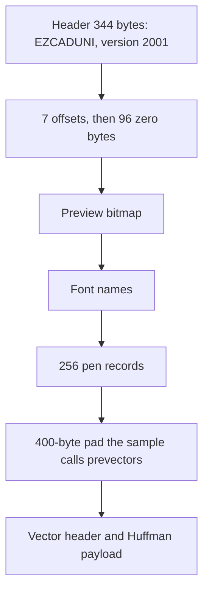
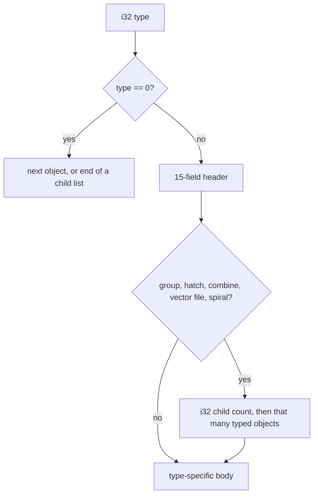
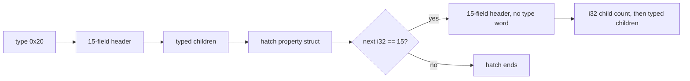

# EZD format

This page describes the EzCad 2 Unicode `.ezd` that `read_ezd` and `write_ezd` implement. The layout was checked against one real job, `AUTOSAVE.EZD` next to this crate (1,493,307 bytes, EzCad 2.14.11). Numbers below that come from that file are labeled as the sample. The writer does not try to reproduce that file byte for byte.

All integers are little-endian. Strings inside the object stream are UTF-16LE and end with a `00 00` word. Curve points are absolute millimeters. Y grows up. The anchor point stored on an object is not added to the geometry.

## File map



The sample is packed with no gaps. Offsets in the seek table are absolute, from the start of the file. The sample's seven offsets are preview, an unused slot, pens, fonts, another unused slot, vectors, prevectors. The writer stores the same order of slots and writes 0 in the two unused slots.

| Seek slot | Sample offset | Writer |
| --- | --- | --- |
| 0 preview | 468 | start of the preview block |
| 1 unused | 0 | 0 |
| 2 pens | 160696 | start of the pen block, before the count |
| 3 fonts | 160492 | start of the font count |
| 4 unused | 0 | 0 |
| 5 vectors | 323920 | start of the five-word vector header |
| 6 prevectors | 323520 | 400 zero bytes placed just before the vectors |

### Header

| Offset | Size | Contents |
| --- | --- | --- |
| 0 | 16 | UTF-16LE `EZCADUNI`, eight code units, no extra trailing null past that |
| 16 | 4 | `i32` 0 |
| 20 | 4 | `i32` 2001 |
| 24 | 180 | three 60-byte UTF-16 strings in the sample. The writer leaves these zero |
| 204 | 140 | tail. The writer leaves this zero |

`read_ezd` rejects a file whose first 16 bytes are not `EZCADUNI`. It does not check that the version word is 2001.

### Preview

Six `i32` values, then `width * height` pixels of 4 bytes:

| Word | Sample and writer |
| --- | --- |
| 0 | 0 |
| 1 | width 200 |
| 2 | height 200 |
| 3 | 800 |
| 4 | `0x00200001` |
| 5 | 0 |

A pixel is a COLORREF in the first three bytes, `0x00BBGGRR`, and the fourth byte is 0. White in the sample is `ff ff ff 00`. The writer fills the bitmap white, then draws every path in dark gray (`22 22 22 00`) with an 8 pixel margin. The reader checks that the size is sane and skips the pixels. The window draws from paths, not from this bitmap.

### Fonts

`i32` count, then `count` names of 100 bytes each (UTF-16LE). The sample has two: `Arabic Transparent` and `Arial`. The writer stores a count of 0. The reader loads the names and then discards them. They are not on `Document`.

### Pens

`i32` count (256), then `i32` absolute offset of the first record, then 256 records.

Each record is a struct-list (see below). The sample's pen 0 is 636 bytes and 61 fields. That blob, including its leading count, is `src/ezd/pen_template.bin`. EzCad walks the struct, so a name that changes the length of field 1 is valid. The writer does not keep a fixed 636-byte stride.

Fields the reader and writer use:

| Index | Type | Meaning |
| --- | --- | --- |
| 0 | `i32` | COLORREF `0x00BBGGRR`. Red is the low byte. Pen 1 in the sample is `0x00FF0000`, which is blue |
| 1 | UTF-16LE | pen name, null-terminated |
| 4 | `i32` | passes. The writer stores at least 1 |
| 5 | `f64` | speed in mm/s. Sample pen 0 is 500 |
| 6 | `f64` | power already in percent. Sample pen 0 is 50.0. Do not scale by 10 |
| 7 | `i32` | frequency in Hz. Sample pen 0 is 20000. The document stores kHz, so the writer multiplies by 1000 and the reader divides by 1000 |

Other fields stay as they are in the template: delays, wobble, and the rest of the fiber-laser defaults from that one pen. Editing them means changing the template or teaching `pen_record` a new field index. Read a real pen with a small dump before changing an index. A wrong index shifts every later field.

## Struct-list

Used for pens, object headers, and property blocks.

```text
i32 count
repeat count times:
    i32 byte_length
    byte_length bytes
```

How the reader treats a field depends on its length. 2 bytes is a `u16`, not a string. 4 bytes is an `i32`. 8 bytes is an `f64`. 16 bytes is a point, two `f64` values. An even length that is longer is often UTF-16LE with a trailing null word. `struct_fields` refuses a count above the caller's limit and a length above 8,000,000.

## Vector section

Five `u32` words, then the Huffman payload:

| Word | Sample | Writer |
| --- | --- | --- |
| uncompressed length | 1,318,532 | length of the raw object bytes |
| content checksum | 31,893 | CRC-16/X-25 of the raw object bytes |
| compressed payload length | 1,167,573 | byte length after the Huffman table |
| data start | 323940 | absolute file offset of the `u16` table length, which is `vectors_at + 20` |
| header checksum | 49,158 | CRC-16/X-25 of the first 16 header bytes |

EzCad checks these two words on open. The dialog "Fail to pass Data verification error,maybe the file is damaged!" is that check failing. The content checksum covers the uncompressed object bytes. The header checksum covers the 16 bytes before it: uncompressed length, content checksum, payload length, and data start. It does not cover itself. Both are CRC-16/X-25 (reflected polynomial 0x8408, initial value 0xFFFF, final XOR 0xFFFF), stored in the low 16 bits of the `u32`. The sample values 31,893 and 49,158 are the checksums of `AUTOSAVE.EZD`, not constants. Compute the content checksum first, because those bytes sit inside the 16-byte header region.

The header check runs before EzCad builds the Huffman tree. A later rejection with a different message would point at the table, not these words.

### Huffman

```text
u16 table_len
repeat table_len times:
    u8 symbol
    u32 code
    u16 bit_length
then the bit stream
```

The code uses the low `bit_length` bits. Bits are read MSB first inside each byte. Decode stops after `uncompressed` bytes.

The sample table has 256 symbols and a real compression. The writer emits an identity table: symbol N, code N, length 8, then the raw object bytes. That table is prefix-free. `huffman_decode` inverts it. The decoder keys a `HashMap` by `(bit_length, code)` so a dense table stays cheap. A code length of 0 or above 32 is an error. Running past `max_len` without a match is an error.

`payload length` in the vector header is `compressed.len() - (2 + 256 * 7)`. For the identity table that equals the raw object length.

## Object stream

After decompression the bytes are a sequence of typed objects, then a type `0` that ends a list. The reader treats type 0 as "continue" and stops when fewer than 4 bytes remain, so a terminator in the middle of a child list ends that list.



Header fields, in order:

| Index | Type | Use |
| --- | --- | --- |
| 0 | `i32` | pen, clamped to 0..=255 |
| 1 | `u16` | a copy of the object type |
| 2 | `u16` | state bits in the sample: hidden `0x01`, selected `0x02`, locked `0x10`. The writer stores 0 |
| 3 | UTF-16 | object name. The writer keeps at most 40 Unicode scalars |
| 4 | `i32` | 1 |
| 5..8 | `u16` | 0 |
| 9 | `i32` | array count X, writer stores 1 |
| 10 | `i32` | array count Y, writer stores 1 |
| 11 | `f64` | array step X, writer stores 10 |
| 12 | `f64` | array step Y, writer stores 10 |
| 13 | 16 bytes | anchor point. The writer stores the first point of the contour. It is not added to the points |
| 14 | `f64` | Z, writer stores 0 |

### Types

| Type | Value | Reader | Writer |
| --- | --- | --- | --- |
| end | 0 | ends the current list | one `i32` 0 after the last curve |
| curve | 1 | polylines, quads, and cubics | one object per contour, line type 1 |
| rectangle | 3 | four corners from the min and max points | not written |
| circle | 4 | 48-step loop | not written |
| ellipse | 5 | bounds at fields 1 and 2, 48 steps | not written |
| polygon | 6 | regular polygon, side count at field 7, 3 to 64 sides | not written |
| group | `0x10` | children only | not written |
| hatch | `0x20` | children, then the hatch tail below | not written |
| combine | `0x30` | children only | not written |
| image | `0x40` | skipped. See below | not written |
| vector file | `0x50` | children, then one property struct | not written |
| spiral | `0x60` | children, a property struct, then one more typed object | not written |
| text | `0x800` | string kept as a note. Glyph outlines are separate curve children when the file has them | not written |
| timer | `0x2000` | one property struct, no path | not written |
| input | `0x3000` | one property struct | not written |
| output | `0x4000` | one property struct | not written |
| extend axis | `0x5000` | one property struct | not written |
| encoder | `0x6000` | one property struct | not written |

An unknown type is a hard error. The message includes the decompressed byte where the object started. Add a match arm in `parse_typed` before trying to parse further. Do not skip a body whose size you have not measured. The next object would be read at the wrong place.

### Curve body

```text
u32 contour_count
u32 closed          one flag for every contour in the object
repeat contour_count times:
    6 bytes: u8 unknown, u8 curve_type, u16, u16
    if curve_type == 0:
        5 f64 values, skipped
    else:
        i32 point_count
        point_count times: f64 x, f64 y
```

`curve_type` 1 is a polyline and is kept as stored. Type 2 is quadratic and type 3 is cubic. Both are sampled to polylines, eight steps per span, and the control points are dropped. A later save cannot restore the original beziers.

The writer emits `contour_count = 1`, the closed flag, then the 6-byte header `00 01 00 00 00 00` (unknown 0, line type 1), then the points. A closed contour repeats its first point when the gap is larger than `1e-8`.

### Hatch tail

This is the case that desynchronizes a parser.

A hatch has a normal type code, a 15-field header, a child count, and typed children. After those children comes a property struct. The next `i32` is often 15. That 15 is the field-count of a cached group. The cached group has no type code.



`parse_hatch_tail` implements that rule. On the sample job the decompressed stream is consumed in full: 1,318,532 of 1,318,532 bytes. Inventory of that file: 1045 curves, 242 groups, 20 hatches, 18 texts, 2 vector files, 1 rectangle, 1 terminator. About 68,672 flattened points. Bounds about x −41.7 to 40.8 and y −22.8 to 37.1.

If a new file fails with "unknown object type 15", the hatch tail is the first place to check. Type 15 is not an object.

### Text

After the 15-field header, a property struct. Field 10 is the UTF-16 string, stored on `Document.notes`. Then an `i32` part count. Each part is 2 bytes plus two struct-lists. Then one trailing `i32`. Changing the string in the note list does nothing on save, because the writer never emits type `0x800`. The outlines that EzCad would mark are the curve objects already in the file.

### Image

A property struct, then a bitmap: 2 marker bytes, an `i32` size that includes those 6 bytes, then `size - 6` bytes. The reader skips this. It does not add a path.

## Sample nameplate strings

The 18 text notes in `AUTOSAVE.EZD` are the machine nameplate: Model, Work Size, Laser Power, Voltage, Ex Factory Date, Series Number, FIBER LASER MARKING MACHINE, Made In China, Total Power, TSF-30, 110*110MM, Raycus 30W, 220V/60HZ, 0.3KW, Translaser Equipamentos LTDA, www.translaser.com.br, MDBX6339, 2022.04.25. Fonts named in the text objects include SimHei (黑体) and Arial, with a height around 10 mm. The test `reads_the_sample_ezd_nameplate` checks that "Model" is present and that the point count and bounds are in range. It reads `../AUTOSAVE.EZD`, which is outside this git repository.
